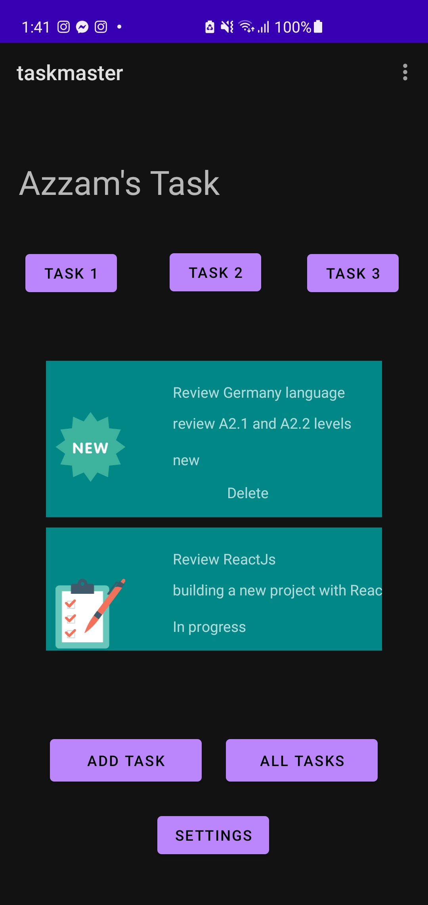

# Taskmaster

## Overview

This repository includes an Android app that will be the main focus of the second half of the 401 course. over time this will grow to be a fully-featured application.

## Architecture

The programing language used to build this project is java and using the Android Studio to complete it.

**Author: Motasim Al-Azzam

## Lab: 26 - Beginning TaskMaster

This lab is an introduction to Android and how to use the Android Studio. In this lab I create three activities, The Main Activity, Add Task Activity and All Task Activity.

### Main Activity

It is the home page which contains an image and two buttons each one starts a new activity when click on it.

### Add Task Activity

When the user click on `ADD TASK` button from home page it will take The user to this page(*Add Task Page*). In this page the user can add a task title and a description and after that can click on th `ADD TASK` button.

When the user click on the `ADD TASK` button it will show a message that the task is submitted.

### All Task Activity

When the user click on `ALL TASK` button from home page it will take The user to this page(*All Task Page*). This page contains an image.

## Lab: 27 - Data in TaskMaster

In This lab added three buttons on the main page, each button for one task that takes the user to the task detail page when the user clicks on it. Also, added a setting button on the home page that takes the user to the setting page.

### Setting Activity

This page contains a fild which the user can put his/her name and click on save buttons to save the name.

### Main Activity

The home page contains new four buttons. The first three buttons for tasks, Each button takes the user to a different task detail page. and the fourth button for the setting page that I showed you above. Also, the name that the user wrote on the setting page appears at the top of the main page.

### Task Detail Activity

Task detail page appears when the user click on each task on the home page.

## Lab: 29 - Room

In this lab, I added a Room database to save the tasks and the details of tasks and get data from it, and let the recycler view take the data from the room database. 

### Add Task Activity

On this page, Added a new field in which can the user writes the state of the task.

Also added a spinner in which the user can select one of the choices for the image of the task.

### Main Activity

 This is the home page and it conains tasks and each task has an image depends on the user choise from the spinner.

### All Task Activity

Refactored this page to show all user tasks.

 